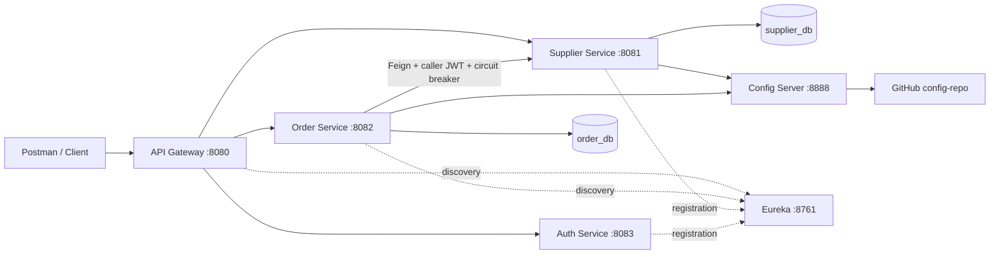

# BuyDesk

A Java backend for deciding which suppliers should supply required parts, in what quantities, and at what cost before a deadline. The planner considers lead times, minimum order quantities, capacity, and all-units bulk discounts, and explains its allocations and shortages.

The repository also contains supplier CRUD, manual purchase orders, JWT authentication, service discovery, and centralized configuration. These support APIs are separate from the stateless purchasing planner.

## Assignment: what to buy, and from whom

The purchasing decision engine is implemented in **order-service**. It takes a weekly demand list and a supplier-offer snapshot, then returns an exact minimum-cost on-time allocation under explicit assumptions. Unlike the existing manual order API, the caller does **not** choose the winning supplier or allocated quantities.

- Endpoint: **POST /api/orders/purchase-plans**, through gateway port 8080 or directly on order-service port 8082.
- Authentication: use an **abinash** bearer token (write scope). Viewer cannot POST a plan.
- Demo input: [examples/purchase-plan.json](examples/purchase-plan.json).
- Algorithm and assumptions: [docs/PURCHASING-PLANNER.md](docs/PURCHASING-PLANNER.md).
- Output: per-part supplier allocations, prices, costs, arrival dates, rejected/unused suppliers, explanations, and shortages.
- Planning is a stateless proposal. It does not reserve capacity or place purchase orders.

### Quick demonstration

1. Start the services using the setup below and log in as asit.
2. In Postman select POST, paste `http://localhost:8080/api/orders/purchase-plans`, and set Bearer Token.
3. Paste the contents of `examples/purchase-plan.json` into Body → raw → JSON.
4. Expect `FULFILLED`, total cost **900.00**, and **100 units from SUP-B**. SUP-LATE is rejected for missing the deadline; SUP-A loses on total cost despite its lower bulk unit price.
5. Change SUP-B capacity to 30: expect `SHORTAGE`, supplied **90**, shortage **10**, and total cost **840.00**.

Run the focused engine and API contract tests without databases or other services:

```text
cd order-service
./mvnw -Dtest=PurchasePlannerTest,PurchasePlanControllerTest test
```

These tests compile the service and include 200 deterministic small cases checked against exhaustive enumeration. They are separate from the generated full-context startup test and do not validate the deployed security chain.

## Services

| Service | Port | Responsibility |
| --- | --- | --- |
| api-gateway | 8080 | Routes requests and validates JWTs |
| supplier-service | 8081 | Supplier CRUD, validation, and duplicate-code checks |
| order-service | 8082 | Calculate purchase plans; create, retrieve, and cancel manual orders |
| auth-service | 8083 | Authenticate local accounts, issue JWTs, publish public keys |
| discovery-server | 8761 | Eureka service registry |
| config-server | 8888 | Read service configuration from GitHub |

## Architecture



The gateway and both business services validate tokens. Order-service forwards the authenticated caller's token when checking a supplier. Manual order creation saves an order after successful supplier verification. The purchase-plan endpoint uses the submitted offers directly and neither calls supplier-service nor writes a plan to the database.

## Technology

- Java 17 target; local development has also used JDK 21
- Spring Boot 4.1.1 and Spring Cloud 2025.1.x; exact versions are in each service's POM
- Spring MVC, Spring Data JPA, Hibernate, MySQL, Bean Validation
- Spring Cloud Gateway Server Web MVC, Eureka, Config, OpenFeign
- Resilience4j, Spring Security OAuth2 Resource Server, RS256 JWTs
- Maven Wrapper, Eclipse, Postman

## Local setup

### 1. Clone and import

Clone the repository and import each service into Eclipse using **File → Import → Maven → Existing Maven Projects**. Each service has its own POM and Maven Wrapper; there is no root aggregator POM.

```text
git clone https://github.com/abinash45/buydesk.git
cd buydesk
```

Requirements: JDK 17 or 21, MySQL running on localhost:3306, OpenSSL, and access to GitHub for Config Server.

### 2. Create databases

Run in your MySQL client:

```sql
-- Separate databases owned by each business service
CREATE DATABASE IF NOT EXISTS supplier_db;
CREATE DATABASE IF NOT EXISTS order_db;
```

Local datasource configuration uses MySQL username `root`. Change it in each service's application.properties if your installation uses a different account. Hibernate's `ddl-auto=update` creates/updates tables for local development.

### 3. Configure passwords

In **Eclipse → Run → Run Configurations → Spring Boot App → select service → Environment**, set:

| Service | Variable | Value |
| --- | --- | --- |
| supplier-service | DB_PASSWORD | Your MySQL password |
| order-service | DB_PASSWORD | Your MySQL password |
| auth-service | AUTH_PASSWORD | admin123 for the abinash account |
| auth-service | VIEWER_PASSWORD | password configured for the viewer |

Click **Apply** and restart affected services after changing environment variables. Use strong ASCII passwords within the login input's 64-character limit. Do not put actual passwords, tokens, or private keys into Git. Spring does not automatically load a `.env` file in this setup.

### 4. Create persistent signing keys

On macOS/Linux, run these commands **once on a new machine**. Do not overwrite existing keys when restarting the application.

```text
mkdir -p ~/.buydesk/keys
openssl genpkey -algorithm RSA -pkeyopt rsa_keygen_bits:2048 -out ~/.buydesk/keys/auth-private.pem
chmod 600 ~/.buydesk/keys/auth-private.pem
openssl pkey -in ~/.buydesk/keys/auth-private.pem -pubout -out ~/.buydesk/keys/auth-public.pem
```

Auth-service reads these files from the Java process's user home. The private key signs tokens; only the public key is published at `http://localhost:8083/.well-known/jwks.json`. Keys remain outside this repository. Keeping the same key pair allows unexpired tokens to work across auth-service restarts.

### 5. Configuration repository

Config Server reads branch `main` of this repository and searches the `config-repo` directory:

- `config-repo/supplier-service.properties`: supplier port and Eureka address
- `config-repo/order-service.properties`: order port, Eureka address, and Feign timeouts

If using a fork, update `spring.cloud.config.server.git.uri` in config-server's application.properties. Commit and push central configuration changes so Config Server can fetch them. Restart client services to apply changes; automatic refresh is not configured.

Supplier-service and order-service use a required `spring.config.import=configserver:http://localhost:8888`, so Config Server must be available at their startup. Database passwords stay in local environment variables.

### 6. Startup order

Start MySQL, then run the main classes in Eclipse in this order:

1. ConfigServerApplication — config-server
2. DiscoveryServerApplication — discovery-server
3. AuthServiceApplication — auth-service
4. SupplierServiceApplication — supplier-service
5. OrderServiceApplication — order-service
6. ApiGatewayApplication — api-gateway

Allow time for Eureka registration and discovery caches to update, usually around 30 seconds. View the registry at `http://localhost:8761`.

Alternatively, run `./mvnw spring-boot:run` from each service directory in a separate terminal, with its required environment variables already set. Windows uses `mvnw.cmd`.

## Login and permissions

Use Postman **POST**, **Authorization → No Auth**, **Body → raw → JSON**:

```text
http://localhost:8080/api/auth/login
```

```json
{
  "username": "abinash",
  "password": "admin123"
}
```

Replace the configured password locally. For the current setup, use username `abinash` and password `admin123`.

A successful response contains `accessToken`, `tokenType` (`Bearer`), and `expiresIn` (`900` seconds). Copy only the token value into Postman's **Authorization → Bearer Token** field. Do not include quotes or an extra `Bearer` prefix.

| Account | Scope | Allowed operations |
| --- | --- | --- |
| abinash | buydesk.read buydesk.write | Read and write supplier/order APIs |
| viewer | buydesk.read | Read supplier/order APIs |

Tokens use RS256, issuer `http://localhost:8083`, and audience `buydesk-api`. Signature, issuer, audience, and expiration are validated. There is no refresh-token endpoint; log in again after expiry. These permissions are scopes, not separate `ROLE_ADMIN` authorities.

## API reference

Use gateway base URL `http://localhost:8080`. Supplier/order endpoints require a bearer token.

| Method | Path | Expected success |
| --- | --- | --- |
| POST | /api/auth/login | 200, token response |
| POST | /api/suppliers | 201, created supplier |
| GET | /api/suppliers | 200, supplier list |
| GET | /api/suppliers/{id} | 200, supplier |
| PUT | /api/suppliers/{id} | 200, updated supplier |
| DELETE | /api/suppliers/{id} | 204, empty body |
| POST | /api/orders/purchase-plans | 200, plan with FULFILLED or SHORTAGE status |
| POST | /api/orders | 201, created manual order |
| GET | /api/orders | 200, order list |
| GET | /api/orders/{id} | 200, order |
| PATCH | /api/orders/{id}/cancel | 200, cancelled order |

Replace `{id}` with an actual numeric ID; do not paste placeholders literally into Postman URLs.

### Supplier POST/PUT body

```json
{
  "supplierCode": "DEMO001",
  "supplierName": "Demo Supplier"
}
```

Create a supplier first and use its returned ID in the order body. This example assumes the returned ID is 2:

```json
{
  "supplierId": 2,
  "itemName": "Keyboard",
  "quantity": 2,
  "unitPrice": 1500.00
}
```

The total is calculated as quantity × unitPrice using BigDecimal. New orders have status CREATED. Cancellation changes status to CANCELLED and preserves the record. Cancellation requires no request body. Every successful order POST creates a new order.

Handled responses include 400 for invalid business input, 401 for invalid credentials or missing/invalid tokens, 403 for insufficient scope, 404 for missing resources, 409 for duplicate supplier codes, and 503 when supplier verification is unavailable. Some framework-level malformed-request errors may currently appear as 403 because the default error dispatch is denied by security.

## Verification status

The focused planner suite passed from a fresh local Git clone: **10 tests, zero failures or errors** (8 engine tests and 2 API contract tests). The run used the existing Java installation and Maven dependency cache. It does not establish that all six services start on a completely clean machine. The full multi-service startup from a new environment remains unverified.

The planner was also exercised through the gateway with a bearer token and returned the expected FULFILLED plan costing 900.00. The shortage scenario above is a reproducible follow-up check; do not treat its expected output as a separate recorded live-test result.

## Demonstration checklist

The following CRUD, security, authentication, and configuration scenarios were exercised during development. The purchasing planner additionally has the focused automated test suite described above.

1. Log in as abinash ; create a supplier, then create an order using the supplier ID returned by the supplier API.
2. Read suppliers and orders through the API Gateway.
3. Cancel an order and GET it again to verify that its status is CANCELLED.
4. Submit blank supplier fields and reuse an existing supplier code to verify validation and conflict responses.
5. Request a business endpoint without a token or with an invalid token; expect 401 Unauthorized.
6. Verify that the direct supplier-service (8081) and order-service (8082) business endpoints also reject requests without a valid token.
7. Log in as viewer; GET supplier/order endpoints should return 200, while order creation should return 403 Forbidden.
8. Repeat order creation as abinash ; expect 201 Created.
9. Obtain a JWT, restart auth-service, and reuse the token before its 15-minute expiry to verify that the token remains valid.
10. Check Config Server responses at /supplier-service/default and /order-service/default on port 8888; propertySources should be non-empty.

### Circuit-breaker test

With a valid asit token, stop supplier-service and submit order requests. Supplier verification should return 503 and no order should be saved.

The `supplierLookup` breaker uses a count-based window of 5 calls, a minimum of 5 counted calls, a 50% failure threshold, a 10-second open period, and 2 half-open trial calls. Missing-supplier 404 exceptions are ignored by the breaker. Feign connection/read timeouts are 3/5 seconds.

To observe state changes, temporarily set `logging.level.io.github.resilience4j.circuitbreaker=DEBUG` in order-service and restart it. Five failed lookups from a fresh breaker open the circuit; a subsequent request during the open period is rejected without a supplier call. Restart supplier-service, allow discovery to update, and make successful trial requests to close the circuit. Successful POST trials create orders. Restore INFO logging afterward.

## Troubleshooting

| Symptom | Check |
| --- | --- |
| DB_PASSWORD unresolved | Set the database password on the correct Eclipse run configuration and restart |
| Cannot load signing key | Ensure both PEM files exist under the Java user's `.buydesk/keys` directory |
| Config Server startup/import error | Start `config-server` on port 8888 first; check GitHub access, branch, and config-repo files |
| Eureka connection refused | Start `discovery-server` on port 8761 |
| 401 with a token | Get a fresh token; paste only its value; verify issuer, audience, and public-key endpoint |
| Viewer gets 403 on POST | Expected: `viewer` only has `buydesk.read` permission |
| Login fails | Use POST, select **No Auth**, and send a JSON body with the configured `abinash` account credentials |
| Feign supplier verification returns 503 | Check supplier registration, token forwarding, downstream logs, and circuit-breaker state |
| Java import cannot be resolved | Put the required starter dependencies in the main dependencies block and update Maven |
| Package mismatch | Match the Java package declaration to its source directory |

## Assumptions and deliberately omitted scope

The planner maximizes on-time supplied quantity first, then minimizes purchase cost. Quantities are integers; split allocations are allowed and overbuying is not. Discounts apply to the entire supplier lot. Capacity is independent per supplier/part snapshot, with no shared global capacity or reservation. Lead times use calendar days. See [the planner documentation](docs/PURCHASING-PLANNER.md) for input limits, complexity, tie handling, and the complete assumptions.

- **Frontend:** omitted; the application is backend-focused and the APIs can be demonstrated using Postman.
- **Docker:** omitted from the current setup; services are started manually using the configuration described above.
- **Persisted offers, plans, and automatic order placement:** omitted to keep the purchasing decision explicit and reproducible from a submitted snapshot. A generated plan does not automatically create an order record.

## Current limits

This is a local demonstration, not a production deployment:

- Authentication uses two in-memory accounts and a custom login endpoint, not a complete OAuth2/OIDC authorization server. No registration, refresh tokens, revocation, lockout, or rate limiting is implemented.
- Signing keys are persistent local files; managed storage and key rotation are not implemented. Local traffic uses HTTP.
- Config Server and Eureka are local infrastructure without configured authentication. Do not expose them publicly as-is.
- Supplier duplicate prechecks are not atomic with database writes; concurrent conflicts need consistent database-exception handling.
- Supplier deletion does not coordinate with existing orders. There is no distributed transaction or supplier-name snapshot.
- Order cancellation is a basic status update; no optimistic locking, approval workflow, idempotency key, pagination, or order editing is implemented.
- Supplier lookup currently maps most Feign errors, including downstream authentication errors, to 503.
- Schema updates use Hibernate ddl-auto=update instead of versioned migrations.
- The purchasing planner has focused engine and API contract tests; a comprehensive automated suite for the other flows and a CI pipeline have not been verified. Deployment automation and production observability are not included.

## Repository layout

```text
procurement-system/
├── api-gateway/
├── auth-service/
├── config-server/
├── discovery-server/
├── order-service/
├── supplier-service/
├── config-repo/
├── docs/PURCHASING-PLANNER.md
├── examples/purchase-plan.json
└── README.md
```
